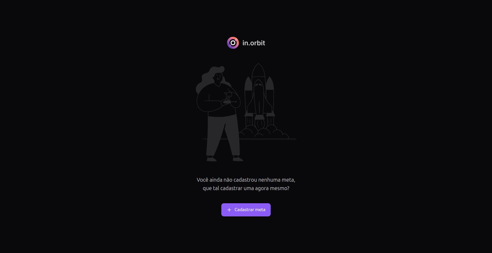
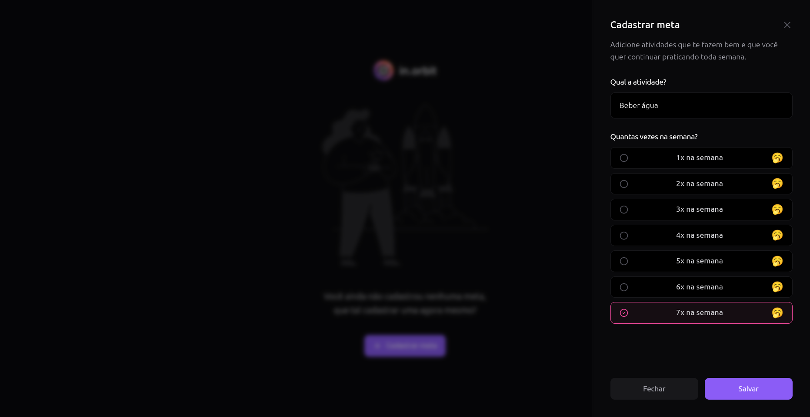
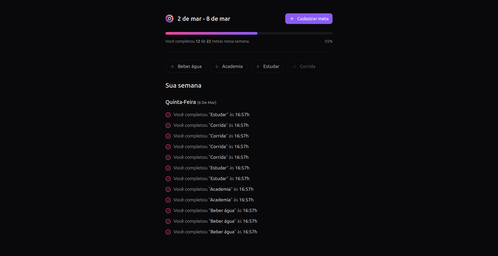

<p align="center">
  <h1 align="center"><a href="https://food-explorer-vasc-333.netlify.app/">My Orbit 📝</a></h1>
</p>

> Status: Finished ✅

### 1. Initial page:



### 2. Create goal:



### 3. Goal created:



## About the project 📝

This project is a ranking system that tracks and ranks users based on the number of registrations made through their unique referral links. It also takes into account the number of clicks on each link, providing a more comprehensive view of engagement and effectiveness.

The system highlights the top 3 users with the highest number of successful referrals, encouraging participation and competition. Whether for marketing campaigns, affiliate programs, or community growth initiatives, this ranking mechanism helps measure user influence and incentivizes engagement.

## Technologies used in this project 🛠️

- [Vite](https://vite.dev/)
- [ReactJS](https://legacy.reactjs.org/docs/getting-started.html)
- [TailwindCSS](https://tailwindcss.com/)
- [Lucide React](https://lucide.dev/guide/packages/lucide-react)
- [Radix UI](https://www.radix-ui.com/)
- [Zod](https://zod.dev/)

## How can I use it? 💻

### 1. Clone the project to your computer.

```bash
#It is necessary to make a clone of the API version and another clone of the WEB version
#To WEB version:
$ git clone git@github.com:hgsanson/myorbit-web.git

#To API version:
$ git clone git@github.com:hgsanson/myorbit-api.git
```

<br>

### 2. With the project open in an IDE, open the myorbit-api and run the commands:

```bash
# Install the packages needed to run the project
$ npm install
```

```bash
# Run the Docker (must be installed in your environment)
$ docker compose up -d
```

```bash
# Create database migration
$ npx drizzle-kit push
```

```bash
# Run the API
$ npm run dev
```

<br>

### 3. With the server connected, now open the myorbit-web file in an IDE of your choice and run it:

```bash
# Install the packages needed to run the project
$ npm install
```

```bash
# To start frontend
$ npm run dev
```

<br>

### 4. Now you can test the app! 🎉
